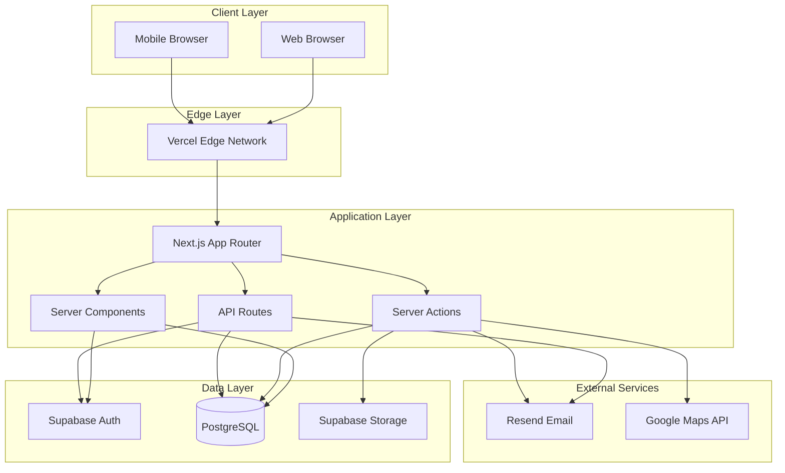

# Project Specification: LEAD Talent Platform (Frontier)

**Version:** 1.1  
**Last Updated:** April 2026  
**Status:** Production Ready

---

## 1. Executive Summary

### 1.1 Project Overview
The **LEAD Talent Platform (Frontier)** is a comprehensive SaaS application designed to connect three primary stakeholder groups within the LEAD Americas ecosystem:

> **LEAD Americas** empowers the next generation of leaders in Latin America and the United States to reach their full potential while transforming Latin America into a global hub for technology, leadership, and innovation.

As the organization enters a new stage of maturity, LEAD has evolved from student training into a **strategic talent pipeline builder**. Through Frontier, we bridge rigorous preparation with real-world opportunity — giving students professional visibility and connecting organizations with high-potential talent who bring strong mindset, values, and execution skills.

**Three Primary Stakeholder Groups:**

1. **Student Members** - University students seeking professional development, event participation, and recruitment opportunities
2. **Chapter Editors** - Chapter leaders managing local LEAD chapters, events, and member approval workflows
3. **Corporate Recruiters** - Companies seeking to recruit diverse, high-potential talent from LEAD chapters

### 1.2 Business Objectives
- **Bridge preparation with opportunity**: Connect LEAD-trained students with corporate recruiters through a professional talent pipeline
- **Streamline event management**: Enable distributed university chapters to create, collaborate, and manage multi-chapter events
- **Professionalize student visibility**: Transform students into serious professionals ready to engage with industry through verified profiles and member IDs
- **Automate administrative workflows**: Reduce overhead for LEAD administrators through automated approvals, QR check-ins, and email notifications
- **Foster community**: Build a sense of belonging through branded experiences (member ID cards, email branding, event participation tracking)
- **Improve career outcomes**: Drive internship and full-time placement for LEAD members

### 1.3 Vision & Roadmap
The platform is currently prioritizing the **user and editor experience**, with recruiter and admin enhancements planned for subsequent iterations. Key upcoming features include:

- **Student leadership profile add-on**: Color-coded representation of leadership style and learning preferences (per Angela's proposal)
  - Assessment method: Self-reported quiz
  - Color meaning: TBD (to be determined)
- **Event funding requests**: Editors will be able to submit funding requests directly through the platform
  - Workflow: Single assigned reviewer → Notification-only decision (no payment integration in current scope)
  - Status: *Not yet implemented*
- **Enhanced admin dashboard**: Self-service admin tools replacing manual management
- **LEAD Spark integration**: Full platform maturity for the flagship multi-company, multi-student networking event
- **Member ID QR codes**: Distinct QR codes for member ID cards (separate from event QR codes)

### 1.4 Target Users
| User Type | Count Estimate | Primary Goal |
|-----------|---------------|--------------|
| Students | 1,000+ | Find events, build verified profiles, get recruited |
| Chapter Editors | 50+ | Manage chapter activities, approve members, check-in attendees |
| Recruiters | 100+ | Source diverse, high-potential talent |
| Admins | 5-10 | Platform oversight, DNS management, funding request review |

---

## 2. Functional Requirements

### 2.0 Core Philosophy
The platform is designed with four distinct roles, each with carefully scoped permissions:
- **Member**: Students from different chapters who can register for events and build profiles
- **Editor**: Chapter members with elevated permissions (approve members, create events, check-in attendees)
- **Recruiter**: Company representatives with access to browse verified talent (post-approval)
- **Admin**: Platform administrators with full system access

### 2.1 Authentication & Authorization

#### 2.1.1 Authentication Methods
- **Primary:** Google OAuth via Supabase Auth
- **Secondary:** Email/password with verification
- **Session Management:** JWT-based with refresh tokens

#### 2.1.2 Role System
```typescript
type Role = "admin" | "editor" | "member" | "recruiter";
```

| Role | Permissions |
|------|-------------|
| `admin` | Full CRUD on all entities, user impersonation, system settings |
| `editor` | Chapter management, event CRUD within chapter, member approval |
| `member` | Profile management, event registration, resume upload |
| `recruiter` | Browse students (if approved), save candidates, download resumes |

#### 2.1.3 Access Control Rules
- Students can only view/edit their own profiles
- Chapter editors can only manage their own chapter
- Editors can collaborate on events with other chapters
- Recruiters require active recruiter_access record with `is_active: true`
- Admins have cross-tenant access to all data

### 2.2 Event Management

#### 2.2.1 Event Types
| Type | Description |
|------|-------------|
| `in_person` | Physical event with location |
| `online` | Virtual event with meeting URL |
| `hybrid` | Both in-person and online components |

#### 2.2.2 Access Models
| Model | Description |
|-------|-------------|
| `open` | First-come-first-served registration |
| `application` | Application required, manual approval |

#### 2.2.3 Event Lifecycle
```
Draft → Published → Registration Open → Registration Closed → In Progress → Completed
```

#### 2.2.4 Event Features
- **Capacity management** with waitlist support
- **Cover image upload** to Supabase Storage
- **Location autocomplete** via Google Places API (enabling visitors to locate nearest events per Luis's suggestion)
- **Multi-chapter collaboration**: Events can involve multiple chapters (e.g., LEAD Boston + LEAD UP co-hosting a cybersecurity workshop)
- **QR code generation** for secure event check-in
- **Automated email notifications** with LEAD branding
- **Application-based access**: Events can be open registration or application-only with manual approval workflow
- **External form integration**: Support for Typeform/Microsoft Forms links for application events

#### 2.2.5 Event Collaboration Model
The `event_chapter` table enables many-to-many relationships between events and chapters:
- **Event ownership**: Primary chapter (creator) owns the event (stored in `event.chapter_id`)
- **Collaborators**: Additional chapters can be linked to an event
- **Cross-chapter visibility**: Students from any collaborating chapter can discover and register for the event
- **Edit permissions**: Editors from any collaborating chapter can edit the event (shared ownership model)

#### 2.2.6 Check-in System
Editors have access to a dedicated "Check-in" tab in their dashboard:
- **QR code scanning**: Attendees present their event QR code (sent via email upon approval) for instant check-in
- **Manual search fallback**: Editors can search attendees by name if QR code is unavailable (useful for large events with hosts at entrances)
- **Real-time attendance tracking**: Automatically records who attended for talent pipeline reporting to companies
- **Data scope**: Attendance linked to `student_profile` and `user` tables; students are aware their attendance is tracked and shared with recruiters
- **Offline handling**: *Next version consideration*

#### 2.2.7 Member ID System
- **Purpose**: Official LEAD identification — proof of being a verified member of the organization
- **Verified identity**: Member IDs are only assigned to authenticated users with completed student profiles who have been manually approved by editors
- **Branded ID cards**: Physical cards (worn on lanyards) display member-specific information, fostering community and professionalism
- **QR code integration**: Member ID cards can include QR codes (*Note: Member ID QR is different from event QR codes — implemented in next version*)
- **Approval workflow**: Editors approve/reject members via dashboard with batch selection support

### 2.3 Student Profile System

#### 2.3.1 Profile Components
- Personal information (name, email, phone)
- Academic information (university, major, graduation year)
- Professional links (LinkedIn, portfolio)
- Skills and interests
- Resume upload (PDF, max 5MB)
- Profile visibility controls

#### 2.3.2 Resume Management
- Secure upload to Supabase Storage
- Metadata stored in `resume` table
- Download tracking for recruiter analytics
- Version history support

### 2.4 Recruiter Portal

#### 2.4.1 Talent Discovery
- Browse student profiles with filters
- Search by university, major, skills
- Save students to shortlist
- Download resumes

#### 2.4.2 Company Management
- Company profile page
- Multiple recruiters per company
- **Recruiter invite system**: Recruiters are **personally invited** (admin-initiated, no self-service signup)
- Activity tracking

#### 2.4.3 Recruiter Access Controls (Current Scope)
- **Access approval**: Recruiters require `recruiter_access.is_active=true` after personal invite
- **Access tiers**: *Not yet implemented* (future: view-only vs download vs contact)
- **Candidate messaging**: *Not yet implemented* (future: direct messaging between recruiters and students)

### 2.5 Chapter Management

#### 2.5.1 Chapter Features
- Chapter profile (name, university, location)
- Member list with role management
- Event creation and management
- Check-in scanner for events
- Collaboration with other chapters

#### 2.5.2 Member Onboarding
- Automated welcome emails
- Profile completion tracking
- Chapter assignment workflow

### 2.6 Email System

All emails feature **LEAD branding** to maintain professional identity and create a sense of community.

#### 2.6.1 Triggered Emails
| Event | Template | Recipients | Notes |
|-------|----------|------------|-------|
| Account created | WelcomeEmail | New user | |
| Sign up confirmation | ConfirmSignUpEmail | New user | |
| Password reset | ResetPasswordEmail | Requesting user | |
| Member approved | MemberApprovalEmail | Approved member | Includes QR code for events |
| Member signup request | MemberRequestEmail | Chapter editors | *Future: notify editors of pending approvals* |
| Event application submitted | ApplicationReceivedEmail | Applicant | Confirmation of application received |
| Event application approved | ApplicationApprovedEmail | Approved applicant | Includes QR code for check-in |
| Event application rejected | ApplicationRejectedEmail | Rejected applicant | |
| Funding request submitted | FundingRequestEmail | Admin reviewer | *Future feature* |
| Funding request decision | FundingDecisionEmail | Requesting editor | *Future feature* |

#### 2.6.2 Email Infrastructure
- **Provider:** Resend
- **Templates:** React Email components
- **Delivery:** Async via webhook handlers
- **Tracking:** Send status logged

---

## 3. Non-Functional Requirements

### 3.1 Performance
| Metric | Target |
|--------|--------|
| Time to First Byte (TTFB) | < 200ms |
| First Contentful Paint (FCP) | < 1.5s |
| Time to Interactive (TTI) | < 3.5s |
| API Response Time (p95) | < 500ms |

### 3.2 Scalability
- Support 10,000+ registered users
- Handle 100 concurrent event registrations
- Store 5,000+ resumes (50GB storage)
- Process 1,000 emails/day

### 3.3 Security
| Requirement | Implementation |
|-------------|---------------|
| Data Encryption | TLS 1.3 in transit, AES-256 at rest |
| Authentication | OAuth 2.0 + PKCE |
| Authorization | RBAC with row-level security |
| Input Validation | Zod schemas on all inputs |
| File Uploads | Type/size validation, virus scanning |
| SQL Injection | Parameterized queries (Supabase client) |
| XSS Protection | React automatic escaping |
| CSRF Protection | SameSite cookies, origin validation |

### 3.4 Availability
- Target uptime: 99.9%
- Planned maintenance windows: Sundays 2-4 AM ET
- Database backups: Daily with 7-day retention

### 3.5 Compliance
- GDPR compliance for EU users
- CCPA compliance for California users
- SOC 2 Type II planned

---

## 4. Technical Architecture

### 4.1 System Architecture Diagram



### 4.2 Database Architecture

#### 4.2.1 Core Tables
```sql
-- Users (extends Supabase Auth)
user {
  id: uuid PK
  email: string
  name: string
  role: enum
  phone: string
  chapter_id: uuid FK
  created_at: timestamp
  updated_at: timestamp
  deactivated_at: timestamp
}

-- Chapters
chapter {
  id: uuid PK
  name: string
  university: string
  city: string
  region: string
  latitude: float
  longitude: float
  instagram_url: string
  created_at: timestamp
}

-- Events
event {
  id: uuid PK
  title: string
  description: text
  event_type: enum
  access_model: enum
  start_at: timestamp
  end_at: timestamp
  location: string
  location_address: string
  location_city: string
  location_latitude: float
  location_longitude: float
  meeting_url: string
  capacity: int
  cover_image: string
  chapter_id: uuid FK
  created_by_id: uuid FK
  is_published: boolean
  created_at: timestamp
}

-- Event-Chapter Collaboration
event_chapter {
  id: uuid PK
  event_id: uuid FK
  chapter_id: uuid FK
  added_at: timestamp
}

-- Companies
company {
  id: uuid PK
  name: string
  created_by_id: uuid FK
  created_at: timestamp
}

-- Recruiter Access Control
recruiter_access {
  id: uuid PK
  company_id: uuid FK
  user_id: uuid FK
  is_active: boolean
  invite_token: string
  invite_expires_at: timestamp
  granted_at: timestamp
  accepted_at: timestamp
  revoked_at: timestamp
}

-- Student Profiles
student_profile {
  id: uuid PK
  user_id: uuid FK
  major: string
  graduation_year: int
  linkedin_url: string
  portfolio_url: string
  is_profile_public: boolean
}

-- Event Registrations
event_registration {
  id: uuid PK
  event_id: uuid FK
  user_id: uuid FK
  status: enum
  registered_at: timestamp
  checked_in_at: timestamp
  qr_code: string
}

-- Resumes
resume {
  id: uuid PK
  user_id: uuid FK
  file_path: string
  file_name: string
  file_size: int
  mime_type: string
  uploaded_at: timestamp
  is_active: boolean
}

-- Saved Students (Recruiter Shortlists)
saved_student {
  id: uuid PK
  recruiter_access_id: uuid FK
  student_user_id: uuid FK
  saved_at: timestamp
  notes: text
}
```

#### 4.2.2 Row Level Security (RLS) Policies
- Users can only read their own user record (except admins)
- Editors can only modify events for their chapter
- Recruiters can only view public student profiles
- Students can only view their own registrations

### 4.3 API Design

#### 4.3.1 Server Actions
Organized by domain:
- `lib/actions/admin/*` - Administrative operations
- `lib/actions/chapter/*` - Chapter management
- `lib/actions/company/*` - Company operations
- `lib/actions/events/*` - Event CRUD and registration
- `lib/actions/recruiter/*` - Recruiter operations
- `lib/actions/student/*` - Student operations

#### 4.3.2 API Routes
| Route | Method | Purpose |
|-------|--------|---------|
| `/api/auth/hooks/send-email` | POST | Supabase auth webhook |
| `/api/events/checkin` | POST | QR code check-in |
| `/api/chapter/members` | GET | Chapter member list |
| `/api/webhooks/resend` | POST | Email status webhooks |

---

## 5. User Interface Design

### 5.1 Design System
- **Framework:** Tailwind CSS 4
- **Components:** Radix UI primitives + shadcn/ui
- **Icons:** Lucide React
- **Typography:** Open Sans (body), Raleway (headings)
- **Color Palette:** Neutral base with dynamic theming

### 5.2 Page Structure

#### 5.2.1 Public Pages
| Route | Description |
|-------|-------------|
| `/[locale]/` | Marketing homepage |
| `/[locale]/about` | About LEAD |
| `/[locale]/events` | Public event listing |
| `/[locale]/faq` | Frequently asked questions |
| `/[locale]/auth/*` | Login, signup, password reset |

#### 5.2.2 Student Portal
| Route | Description |
|-------|-------------|
| `/[locale]/student` | Student dashboard |
| `/[locale]/student/events` | My events |
| `/[locale]/student/profile` | Edit profile |
| `/[locale]/student/resume` | Resume management |

#### 5.2.3 Chapter Portal
| Route | Description |
|-------|-------------|
| `/[locale]/chapter` | Chapter dashboard |
| `/[locale]/chapter/events` | Manage events |
| `/[locale]/chapter/events/[id]` | Event detail |
| `/[locale]/chapter/events/[id]/applications` | Review applications |
| `/[locale]/chapter/events/[id]/checkin` | QR check-in scanner |
| `/[locale]/chapter/members` | Member management |

#### 5.2.4 Recruiter Portal
| Route | Description |
|-------|-------------|
| `/[locale]/company` | Recruiter dashboard |
| `/[locale]/company/browse` | Browse students |
| `/[locale]/company/students/[id]` | Student profile view |
| `/[locale]/company/saved` | Saved candidates |
| `/[locale]/company/profile` | Company profile |

#### 5.2.5 Admin Portal
| Route | Description |
|-------|-------------|
| `/[locale]/admin` | Admin dashboard |
| `/[locale]/admin/users` | User management |
| `/[locale]/admin/chapters` | Chapter management |
| `/[locale]/admin/companies` | Company management |
| `/[locale]/admin/events` | Event oversight |
| `/[locale]/admin/invites` | Recruiter invites |
| `/[locale]/admin/activity` | Activity logs |

---

## 6. Development Standards

### 6.1 Code Organization
```
Rule: Group by feature, not by type
Good:  lib/actions/events/create-event.ts
Bad:   lib/mutations/event-mutations.ts
```

### 6.2 Naming Conventions
| Type | Convention | Example |
|------|------------|---------|
| Components | PascalCase | `EventCard.tsx` |
| Hooks | camelCase, use prefix | `useEventData` |
| Server Actions | camelCase | `createEvent` |
| Types | PascalCase, descriptive | `EventWithDetails` |
| Constants | UPPER_SNAKE_CASE | `MAX_UPLOAD_SIZE` |

### 6.3 File Structure Rules
- One component per file (except small related components)
- Co-locate styles with components (CSS-in-JS or Tailwind)
- Server actions in `lib/actions/[domain]/[action].ts`
- Types in `lib/types.ts` or co-located

### 6.4 Testing Strategy
- Unit tests for utility functions
- Integration tests for server actions
- E2E tests for critical user flows
- Accessibility testing (WCAG 2.1 AA)

---

## 7. Deployment & Operations

### 7.1 Infrastructure
| Component | Provider | Plan |
|-----------|----------|------|
| Frontend | Vercel | Pro |
| Database | Supabase | Pro |
| Email | Resend | Production |
| Storage | Supabase | Pro |
| Maps | Google Cloud | Pay-as-you-go |

### 7.2 CI/CD Pipeline
```
Push to main → Build → Test → Deploy to Vercel
```

### 7.3 Monitoring
- **Analytics:** Vercel Analytics
- **Performance:** Web Vitals
- **Uptime:** Vercel Status + Supabase Status

### 7.4 Backup Strategy
- Database: Daily automated backups (Supabase)
- Code: Git repository
- Files: Supabase Storage with versioning

---

## 9. Appendices

### 9.1 Revision History
| Version | Date | Changes |
|---------|------|---------|
| 1.0 | 2026-04-18 | Initial specification |
| 1.1 | 2026-04-18 | Added LEAD Americas mission, Frontier branding, voice transcript context, and roadmap details |

### 9.2 Related Documents
- `TECHNICAL-DETAILS.md` - Implementation details
- `AGENTS.md` - AI agent guidance (project-specific rules)
- `docs/luma-ux-architecture.md` - UX design documentation
- `docs/luma-ux-implementation-summary.md` - UX implementation notes

### 9.3 Voice Transcript Context

The following insights were extracted from a voice memo describing the platform evolution and priorities:

#### Platform Evolution
The first version of the platform had significant room for improvement. Based on feedback from stakeholders (Luis, Anthony, Angela), the platform has been elevated to the next level with event management functionality that allows students from all chapters to register for events.

#### Key Stakeholder Contributions
- **Luis**: Suggested event management with cross-chapter registration and location-based event discovery (nearest events)
- **Anthony**: Contributed to event management and collaboration vision
- **Angela**: Proposed adding a profile add-on describing students' leadership style and learning preference, represented as a specific color — a contribution planned for future versions

#### Development Priorities (Current)
1. **User experience** (students/members)
2. **Editor experience** (chapter management, approvals, check-in)
3. Recruiter experience (upcoming)
4. Admin experience (upcoming — currently managed directly by the developer)

#### Feature Details

**Event Schema Evolution:**
Initially conceived with basic fields (name, dates, location, description). Expanded to include collaboration support through the `event_chapter` table, recognizing that many events involve multiple chapters (e.g., LEAD Boston + LEAD UP co-hosting cybersecurity workshops).

**Application Workflow:**
Not all events are open to the public. Some require an application process:
- Application form fields with custom questions
- External form integration (Typeform, Microsoft Forms) for complex applications
- Status tracking: pending → accepted/rejected
- Editor dashboard for reviewing requests
- Automated email notifications on decision
- QR code sent to approved applicants for event check-in

**Attendance Tracking:**
Attendance is automatically recorded and can be easily displayed to companies interested in LEAD talent — supporting the talent pipeline mission.

**Member ID Philosophy:**
- Only assigned to authenticated, approved members with completed profiles
- Creates professional identity and sense of community
- Branded ID cards worn on lanyards display member-specific information
- QR codes on cards enable event check-in
- Visual signal of being part of an exclusive, professional community

**Upcoming Features:**
- Funding request system: Editors submit requests (amount, description, event rationale) sent directly to assigned reviewers
- DNS management already in place for official domain routing
- LEAD Spark event: Target for full platform maturity, bringing together multiple companies and students for networking, learning, and internship opportunities

#### Developer Commitment
The platform developer commits to regular communication and documentation updates after each change to ensure clear responsibilities and team alignment.

#### Mission Alignment
The platform is designed to turn students into serious professionals ready to engage with industry, take full advantage of their motivation and strengths, develop professional skills, and ultimately reach their dreams and dream jobs.
