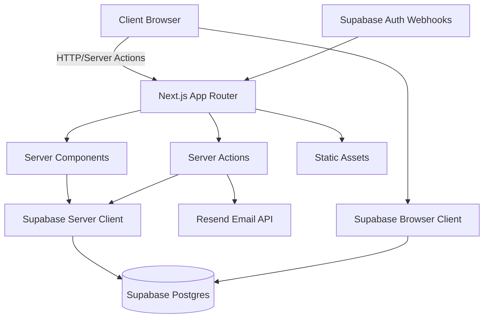
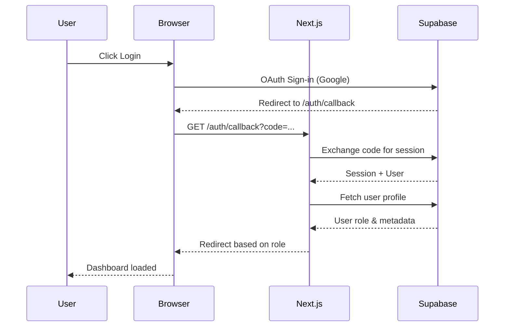

# LEAD Talent Platform (Frontier)

[](https://nextjs.org/)
[](https://react.dev/)
[](https://www.typescriptlang.org/)
[](https://tailwindcss.com/)
[](https://supabase.com/)

A multi-tenant talent platform connecting LEAD Americas student chapters, company recruiters, and student talent through event management and recruitment workflows.

> **LEAD Americas** empowers the next generation of leaders in Latin America and the United States to reach their full potential while transforming Latin America into a global hub for technology, leadership, and innovation.
>
> As the organization enters a new stage of maturity, LEAD has evolved from student training into a **strategic talent pipeline builder**. Through Frontier, we bridge rigorous preparation with real-world opportunity — giving students professional visibility and connecting organizations with high-potential talent who bring strong mindset, values, and execution skills.

## Overview

**LEAD Talent Platform (Frontier)** is a comprehensive web application built for **LEAD Americas** to bridge rigorous student preparation with real-world professional opportunity. The platform transforms students into serious professionals ready to engage with industry while providing companies access to verified, high-potential talent.

**Four Core User Roles:**

- **Students (Members)** — Discover events, build verified profiles, earn member IDs, and showcase resumes to recruiters
- **Chapter Editors** — Manage chapter events, approve members, check-in attendees via QR codes, and collaborate on multi-chapter events
- **Recruiters** — Browse verified student talent, save candidates, download resumes, and build diverse talent pipelines
- **Administrators** — Oversee the entire ecosystem, manage DNS, and review funding requests

**Key Platform Capabilities:**

- **Event Management** — Multi-chapter collaboration, location-based discovery, application workflows, QR check-in
- **Verified Member System** — Manual approval by editors, branded member ID cards, professional identity
- **Talent Pipeline** — Student profiles with resumes, recruiter access controls, shortlist management
- **Automated Workflows** — Branded email notifications, approval workflows, attendance tracking

## Table of Contents

- [Quick Start](#quick-start)
- [Features](#features)
- [Tech Stack](#tech-stack)
- [Project Structure](#project-structure)
- [Architecture](#architecture)
- [Environment Variables](#environment-variables)
- [Development](#development)
- [Deployment](#deployment)

## Quick Start

### Prerequisites

- Node.js 20+
- pnpm (recommended) or npm
- Supabase account
- Resend API key (for emails)
- Google Maps API key (for location features)

### Installation

```bash
# Clone the repository
git clone <repository-url>
cd linke

# Install dependencies
pnpm install

# Set up environment variables
cp .env.local.example .env.local
# Edit .env.local with your credentials

# Run development server
pnpm dev
```

The application will be available at `http://localhost:3000`.

## Features

### Core Modules

| Module | Description |
|--------|-------------|
| **Authentication** | Supabase Auth with Google OAuth, role-based access control |
| **Event Management** | Create, publish, and manage events with capacity control |
| **Registration System** | Open registration and application-based event access |
| **Check-in System** | QR code-based event check-in for chapters |
| **Student Profiles** | Resume upload, profile management, visibility controls |
| **Recruiter Portal** | Browse students, save candidates, download resumes |
| **Chapter Management** | Member management, event collaboration |
| **Admin Dashboard** | User management, chapter oversight, analytics |
| **Email Notifications** | Automated emails for approvals, registrations, invites |
| **i18n Support** | Full internationalization (English/Spanish) |

### Key Capabilities

- **Multi-tenant architecture** with data isolation by chapter/company
- **Event collaboration** between multiple chapters
- **Real-time location search** with Google Places API
- **File storage** for resumes and event cover images
- **Webhook handling** for Supabase auth events
- **Responsive design** with dark/light mode support

## Tech Stack

### Frontend
| Technology | Version | Purpose |
|------------|---------|---------|
| Next.js | 15.x | React framework with App Router |
| React | 19.x | UI library |
| TypeScript | 5.x | Type safety |
| Tailwind CSS | 4.x | Utility-first styling |
| Framer Motion | 12.x | Animations |
| next-intl | 4.x | Internationalization |
| next-themes | 0.4.x | Theme management |

### UI Components
| Technology | Purpose |
|------------|---------|
| Radix UI | Headless accessible components |
| shadcn/ui | Styled component primitives |
| Lucide React | Icon library |

### Backend & Data
| Technology | Purpose |
|------------|---------|
| Supabase | Postgres database + Auth + Storage |
| @supabase/ssr | Server-side Supabase client |
| Zod | Schema validation |

### External Services
| Service | Purpose |
|---------|---------|
| Resend | Transactional email delivery |
| React Email | Email template components |
| Google Maps API | Location autocomplete & maps |
| Supabase Storage | File uploads (resumes, images) |

### Development Tools
| Tool | Purpose |
|------|---------|
| ESLint | Code linting |
| PostCSS | CSS processing |
| TypeScript | Static type checking |

## Project Structure

```
linke/
├── app/                          # Next.js App Router
│   ├── [locale]/                 # i18n locale routing (en, es)
│   │   ├── (public)/             # Public marketing pages
│   │   │   ├── _components/     # Landing page sections
│   │   │   ├── page.tsx          # Homepage
│   │   │   ├── help/             # Help center
│   │   │   ├── privacy/          # Privacy policy
│   │   │   └── terms/            # Terms of service
│   │   ├── admin/                # Admin dashboard
│   │   │   ├── page.tsx          # Admin overview
│   │   │   ├── users/            # User management
│   │   │   ├── chapters/         # Chapter management
│   │   │   ├── companies/        # Company management
│   │   │   ├── events/           # Event oversight
│   │   │   ├── invites/          # Recruiter invites
│   │   │   ├── activity/         # Activity logs
│   │   │   └── settings/         # Platform settings
│   │   ├── chapter/              # Chapter editor portal
│   │   │   ├── page.tsx          # Chapter dashboard
│   │   │   ├── events/           # Chapter event management
│   │   │   └── members/          # Chapter member management
│   │   ├── company/              # Company/recruiter portal
│   │   │   ├── (protected)/      # Protected recruiter routes
│   │   │   ├── login/            # Company login
│   │   │   └── onboard/          # Company onboarding
│   │   ├── student/              # Student portal
│   │   │   ├── page.tsx          # Student dashboard
│   │   │   ├── events/           # Student event view
│   │   │   ├── profile/          # Profile management
│   │   │   └── resume/           # Resume management
│   │   ├── events/               # Public event listing
│   │   ├── discover/             # Student discovery
│   │   ├── recruiter/            # Recruiter student view
│   │   ├── auth/                 # Authentication pages
│   │   ├── faq/                  # FAQ page
│   │   ├── about/                # About page
│   │   ├── layout.tsx            # Root locale layout
│   │   ├── not-found.tsx         # 404 page
│   │   └── globals.css           # Global styles
│   └── api/                      # API routes
│       ├── auth/hooks/           # Supabase auth webhooks
│       ├── chapter/              # Chapter API endpoints
│       ├── events/               # Event API endpoints
│       ├── geocode/              # Geocoding endpoints
│       └── webhooks/             # External webhooks
├── components/                   # React components
│   ├── ui/                       # shadcn/ui components
│   ├── events/                   # Event-related components
│   ├── global/                   # Global shared components
│   ├── auth-button.tsx           # Auth UI components
│   ├── login-form.tsx            # Login form
│   ├── sign-up-form.tsx          # Sign-up form
│   ├── onboarding.tsx            # Multi-step onboarding
│   ├── theme-switcher.tsx        # Theme toggle
│   └── language-switcher.tsx     # Language toggle
├── lib/                          # Utilities and business logic
│   ├── actions/                  # Server actions (thin controllers)
│   │   ├── admin/                # Admin actions
│   │   ├── chapter/              # Chapter actions
│   │   ├── company/              # Company actions
│   │   ├── events/               # Event actions
│   │   ├── recruiter/            # Recruiter actions
│   │   └── student/              # Student actions
│   ├── services/                 # Business logic & database layer (Service Layer)
│   │   ├── __tests__/            # Unit tests for services
│   │   ├── event.service.ts      # Event domain logic
│   │   └── student.service.ts    # Student profile logic
│   ├── supabase/                 # Supabase clients
│   │   ├── client.ts             # Browser client
│   │   ├── server.ts             # Server client
│   │   ├── admin.ts              # Admin client
│   │   └── proxy.ts              # Auth proxy
│   ├── supabase.ts               # Generated database types
│   ├── types.ts                  # Application types
│   ├── auth.ts                   # Auth helpers
│   ├── constants.ts              # Constants
│   ├── email.ts                  # Email configuration
│   └── utils.ts                  # Utility functions
├── emails/                       # Email templates
│   ├── EmailLayout.tsx           # Base email layout
│   └── templates/                # Email templates
│       ├── WelcomeEmail.tsx
│       ├── ConfirmSignUpEmail.tsx
│       ├── ResetPasswordEmail.tsx
│       ├── MemberApprovalEmail.tsx
│       ├── ApplicationReceivedEmail.tsx
│       ├── ApplicationApprovedEmail.tsx
│       └── ApplicationRejectedEmail.tsx
├── i18n/                         # i18n configuration
│   ├── routing.ts                # Locale routing config
│   └── request.ts                # Message loading
├── messages/                     # Translation files
│   ├── en.json                   # English translations
│   └── es.json                   # Spanish translations
├── hooks/                        # Custom React hooks
├── public/                       # Static assets
├── docs/                         # Documentation
├── scripts/                      # Utility scripts
├── next.config.ts                # Next.js configuration
├── tailwind.config.ts            # Tailwind configuration
├── tsconfig.json                 # TypeScript configuration
└── package.json                  # Dependencies
```

## Architecture

### Data Flow



### Authentication Flow



### Role-Based Access

| Role | Capabilities |
|------|-------------|
| **Admin** | Full platform access, user management, chapter/company creation |
| **Editor** | Chapter management, event creation, member management, check-in |
| **Member** | Event registration, profile management, resume upload |
| **Recruiter** | Browse students, save candidates, download resumes |

### Database Schema (Key Tables)

- `user` - Core user accounts with roles
- `chapter` - University chapters
- `company` - Recruiting companies
- `recruiter_access` - Company-recruiter relationships with permissions
- `student_profile` - Student-specific profile data
- `event` - Event data with location and access model
- `event_chapter` - Many-to-many event-chapter collaboration
- `event_registration` - Student event registrations
- `resume` - Resume metadata and storage references
- `saved_student` - Recruiter saved candidates

## Environment Variables

Create a `.env.local` file with:

```env
# Supabase
NEXT_PUBLIC_SUPABASE_URL=https://your-project.supabase.co
NEXT_PUBLIC_SUPABASE_PUBLISHABLE_KEY=your-publishable-key
SUPABASE_SERVICE_ROLE_KEY=your-service-role-key

# Email (Resend)
RESEND_API_KEY=re_xxxxxxxx
RESEND_FROM_EMAIL=noreply@yourdomain.com

# Google Maps
NEXT_PUBLIC_GOOGLE_MAPS_API_KEY=your-google-maps-key

# App
FRONTEND_URL=localhost:3000
```

## Development

### Available Scripts

```bash
pnpm dev          # Start development server
pnpm build        # Production build
pnpm start        # Start production server
pnpm lint         # Run ESLint
pnpm test         # Run all tests (Vitest)
pnpm test:watch   # Run tests in watch mode
```

### Code Style

- **Server Components** by default (no "use client" directive)
- **Client Components** explicitly marked with "use client"
- Path aliases via `@/*` mapped to root
- TypeScript strict mode enabled

### Testing

We use **Vitest** with 100% unit test coverage required for all `lib/services/*` files.

```bash
pnpm test         # Run all tests once
pnpm test:watch   # Run tests in watch mode during development
```

**Architecture:**
- **Service Layer** (`lib/services/`): Contains all business logic and database queries. Must be pure and framework-agnostic.
- **Controllers** (`lib/actions/`): Thin Server Actions that handle auth, Zod validation, and delegate to services.
- **Tests** (`lib/services/__tests__/`): Mock Supabase clients to test logic in isolation.

See `docs/handbook/TESTING.md` for full testing guidelines.

### Database Types

After schema changes, regenerate types:

```bash
pnpm exec supabase gen types typescript --local > lib/supabase.ts
```

### Adding Translations

1. Add keys to `messages/en.json`
2. Add corresponding keys to `messages/es.json`
3. Use `useTranslations()` hook in components

## Supabase Type Generation

### Prerequisites
- Docker Desktop must be running
- Local Supabase instance started

### Quick Start

1. **Start local Supabase:**
   ```bash
   pnpm run supabase:start
   ```

2. **Generate types:**
   ```bash
   pnpm run types:generate
   ```

### Available Commands

| Command | Description |
|---------|-------------|
| `pnpm run types:generate` | Generate types from local Supabase |
| `pnpm run types:watch` | Watch for changes and auto-generate |
| `pnpm run db:pull` | Pull schema from remote + generate types |
| `pnpm run db:push` | Push schema to remote + generate types |
| `pnpm run migration:new <name>` | Create a new migration |
| `pnpm run supabase:start` | Start local Supabase |
| `pnpm run supabase:stop` | Stop local Supabase |
| `pnpm run supabase:status` | Check Supabase status |
| `pnpm run supabase:reset` | Reset local database |

### Workflow for Schema Changes

1. **Create a migration:**
   ```bash
   pnpm run migration:new add_new_feature
   ```

2. **Edit the migration file** in `supabase/migrations/`

3. **Apply the migration:**
   ```bash
   pnpm run supabase:reset
   ```

4. **Types auto-generate** to `lib/database.types.ts`

### Automatic Type Generation

Types automatically regenerate when:
- ✅ You pull Git changes that include migrations (via Git hook)
- ✅ You run `db:pull` or `db:push` commands
- ✅ You manually run `types:generate`

### Using Types in Code

```typescript
import { Database, Tables } from '@/lib/database.generated'

// Use table types
type User = Tables<'user'>
type Event = Tables<'event'>

// Use with Supabase client
const { data } = await supabase
  .from('user')
  .select('*')
  .returns<User[]>()
```

### Important Notes

- ❌ **Never edit** `lib/database.types.ts` manually (auto-generated)
- ❌ **Never use** Supabase Dashboard for schema changes
- ✅ **Always use** migrations for schema changes
- ✅ Types are generated from **local** Supabase by default

## Deployment

### Vercel (Recommended)

1. Connect GitHub repository to Vercel
2. Add environment variables in Vercel dashboard
3. Deploy automatically on push to main

### Environment Requirements

- Node.js 20+
- Build command: `pnpm build`
- Output directory: `.next`

### Post-Deployment

1. Configure Supabase Auth redirect URLs
2. Set up Resend domain verification
3. Configure Google Maps API key restrictions

## License

Private - LEAD Organization

## Support

For technical support or questions, contact the development team.
