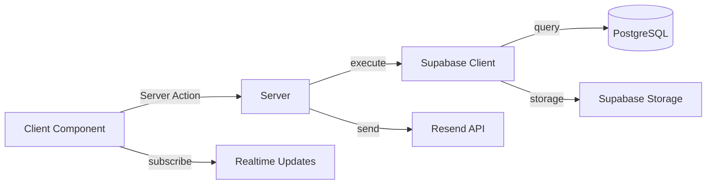
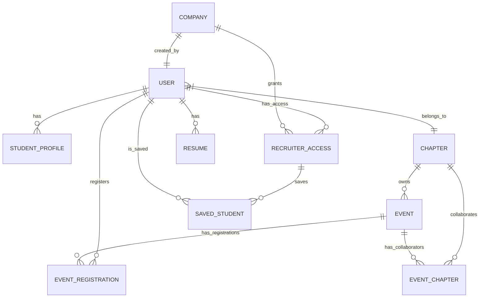
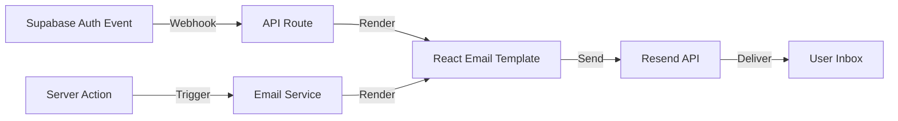

# Technical Details: LEAD Talent Platform (Frontier)

This document provides in-depth technical implementation details for the **LEAD Talent Platform**, codenamed **Frontier**.

> **LEAD Americas** empowers the next generation of leaders in Latin America and the United States to reach their full potential while transforming Latin America into a global hub for technology, leadership, and innovation.
>
> As the organization enters a new stage of maturity, LEAD has evolved from student training into a **strategic talent pipeline builder**. Through Frontier, we bridge rigorous preparation with real-world opportunity — giving students professional visibility and connecting organizations with high-potential talent who bring strong mindset, values, and execution skills.

---

## Table of Contents

1. [Technology Stack Deep Dive](#1-technology-stack-deep-dive)
2. [Project Architecture](#2-project-architecture)
3. [Database Schema](#3-database-schema)
4. [Authentication Implementation](#4-authentication-implementation)
5. [Server Actions](#5-server-actions)
6. [API Routes](#6-api-routes)
7. [Email System](#7-email-system)
8. [File Storage](#8-file-storage)
9. [Internationalization](#9-internationalization)
10. [Component Architecture](#10-component-architecture)
11. [State Management](#11-state-management)
12. [Performance Optimizations](#12-performance-optimizations)
13. [Security Implementation](#13-security-implementation)
14. [Deployment Configuration](#14-deployment-configuration)

---

## 1. Technology Stack Deep Dive

### 1.1 Next.js 15 + React 19

The application uses Next.js 15 with the App Router architecture:

```typescript
// app/[locale]/layout.tsx
export default function LocaleLayout({
  children,
  params,
}: Props) {
  return (
    <html lang={routing.defaultLocale}>
      <body className="antialiased">
        <ThemeProvider defaultTheme="dark">
          <GoogleMapsProvider>
            {children}
          </GoogleMapsProvider>
        </ThemeProvider>
      </body>
    </html>
  );
}
```

**Key Features Used:**
- Server Components by default
- Streaming SSR with Suspense boundaries
- Parallel route loading
- Route groups for organization (`(public)`, `(protected)`)
- Dynamic route segments with `[locale]`

### 1.2 Tailwind CSS 4

Tailwind CSS 4 configuration uses the new CSS-based configuration:

```css
/* app/[locale]/globals.css */
@import "tailwindcss";
@import "tw-animate-css";

@theme inline {
  --font-sans: var(--font-open-sans);
  --font-heading: var(--font-raleway);
  
  --color-background: var(--background);
  --color-foreground: var(--foreground);
  /* ... */
}
```

**Notable Features:**
- CSS-first configuration (no `tailwind.config.js`)
- `@theme` directive for custom properties
- `@tailwindcss/postcss` for processing

### 1.3 Supabase Integration

Three client types for different contexts:

#### Browser Client (`lib/supabase/client.ts`)
```typescript
export const supabase = createBrowserClient(
  process.env.NEXT_PUBLIC_SUPABASE_URL!,
  process.env.NEXT_PUBLIC_SUPABASE_PUBLISHABLE_KEY!,
  {
    auth: {
      flowType: 'pkce',
      persistSession: true,
      detectSessionInUrl: true
    },
  }
)
```

#### Server Client (`lib/supabase/server.ts`)
```typescript
export async function createClient() {
  const cookieStore = await cookies();
  return createServerClient(
    process.env.NEXT_PUBLIC_SUPABASE_URL!,
    process.env.NEXT_PUBLIC_SUPABASE_PUBLISHABLE_KEY!,
    {
      cookies: {
        getAll() { return cookieStore.getAll(); },
        setAll(cookiesToSet) {
          cookiesToSet.forEach(({ name, value, options }) =>
            cookieStore.set(name, value, options)
          );
        },
      },
    },
  );
}
```

#### Admin Client (`lib/supabase/admin.ts`)
```typescript
export function createAdminClient() {
  return createClient(
    process.env.NEXT_PUBLIC_SUPABASE_URL,
    process.env.SUPABASE_SERVICE_ROLE_KEY,
    {
      auth: {
        autoRefreshToken: false,
        persistSession: false,
      },
    }
  );
}
```

### 1.4 next-intl Implementation

**Routing Configuration (`i18n/routing.ts`):**
```typescript
export const routing = defineRouting({
  locales: ['en', 'es'],
  defaultLocale: 'en'
});

export const {Link, redirect, usePathname, useRouter} = createNavigation(routing);
```

**Message Loading (`i18n/request.ts`):**
```typescript
export default getRequestConfig(async ({requestLocale}) => {
  let locale = await requestLocale;
  if (!locale || !isValidLocale(locale)) {
    locale = routing.defaultLocale;
  }
  return {
    locale,
    messages: locale === 'es' 
      ? (await import('../messages/es.json')).default
      : (await import('../messages/en.json')).default
  };
});
```

---

## 2. Project Architecture

### 2.1 Directory Structure Explained

```
app/[locale]/
├── (public)/          # Route group: no auth required
├── admin/             # Admin dashboard routes
├── chapter/           # Chapter editor routes
├── company/           # Recruiter routes
│   ├── (protected)/   # Route group: auth required
│   ├── login/         # Public login page
│   └── onboard/       # Company onboarding
├── student/           # Student portal routes
├── events/            # Public event listing
├── discover/          # Student discovery
├── recruiter/         # Recruiter student view
├── auth/              # Auth callback and login
└── layout.tsx         # Root layout with providers
```

**Route Group Pattern:**
- `(public)` - Marketing pages without authentication
- `(protected)` - Requires authentication and role verification

### 2.2 Layout Hierarchy

```
Root Layout (html, body, providers)
  └── Locale Layout (i18n, theme)
        ├── Public Layout (navbar, footer)
        │     └── Marketing Pages
        ├── Admin Layout (sidebar)
        │     └── Admin Pages
        ├── Chapter Layout (sidebar)
        │     └── Chapter Pages
        ├── Company Layout (sidebar)
        │     └── Recruiter Pages
        └── Student Layout (sidebar)
              └── Student Pages
```

### 2.3 Data Flow Architecture



---

## 3. Database Schema

### 3.1 Core Entity Relationships



### 3.2 TypeScript Database Types

The application uses generated Supabase types (`lib/supabase.ts`):

```typescript
export type Database = {
  public: {
    Tables: {
      user: {
        Row: {
          id: string
          email: string
          name: string
          role: 'admin' | 'editor' | 'member' | 'recruiter'
          chapter_id: string | null
          // ...
        }
        Insert: { /* ... */ }
        Update: { /* ... */ }
        Relationships: [
          {
            foreignKeyName: "user_chapter_id_fkey"
            columns: ["chapter_id"]
            referencedRelation: "chapter"
          }
        ]
      }
      // ... other tables
    }
    Enums: {
      EventType: 'in_person' | 'online' | 'hybrid'
    }
  }
}
```

### 3.3 Composite Types for Queries

```typescript
// lib/types.ts
export type EventWithDetailsRaw = EventRow & {
  ownerChapter: Pick<ChapterRow, 'id' | 'name' | 'university'>[]
  collaborators: (EventChapterRow & {
    chapter: Pick<ChapterRow, 'id' | 'name' | 'university' | 'city' | 'region'>[]
  })[] | null
  CreatedBy: Pick<UserRow, 'id' | 'name' | 'email'>[]
}

export type MemberWithProfile = UserRow & {
  StudentProfile: StudentProfileRow | null;
  Chapter: ChapterRow | null;
}
```

---

## 4. Authentication Implementation

### 4.1 Auth Flow with Google OAuth

```typescript
// lib/auth.ts - Key auth functions
export async function requireUser(): Promise<{ 
  supabase: SupabaseClient<Database>; 
  user: UserRow 
}> {
  const supabase = await createClient();
  const { data: { user: authUser }, error: authError } = await supabase.auth.getUser();

  if (authError || !authUser) {
    redirect('/auth/login');
  }

  const { data: userData, error } = await supabase
    .from('user')
    .select(USER_SELECT)
    .eq('id', authUser.id)
    .single<UserRow>();

  if (error || !userData) {
    redirect('/auth/login');
  }

  return { supabase, user: userData };
}
```

### 4.2 Role-Based Route Guards

```typescript
// Chapter editor verification
export async function requireChapterMember(): Promise<{
  supabase: SupabaseClient<Database>
  user: UserRow
  chapterId: string
}> {
  const { supabase, user } = await requireUser();
 
  if (user.role !== 'editor' && user.role !== 'admin') {
    redirect('/student');
  }
 
  if (!user.chapter_id) {
    redirect('/student');
  }
 
  return { supabase, user, chapterId: user.chapter_id };
}
```

### 4.3 Auth Callback Handler

```typescript
// app/[locale]/auth/callback/route.ts
export async function GET(request: Request) {
  const { searchParams, origin } = new URL(request.url);
  const code = searchParams.get('code');
  const next = searchParams.get('next') ?? '/';

  if (code) {
    const supabase = await createClient();
    const { error } = await supabase.auth.exchangeCodeForSession(code);
    if (!error) {
      const forwardedHost = request.headers.get('x-forwarded-host');
      const isLocalEnv = process.env.NODE_ENV === 'development';
      
      if (isLocalEnv) {
        return NextResponse.redirect(`${origin}${next}`);
      } else if (forwardedHost) {
        return NextResponse.redirect(`https://${forwardedHost}${next}`);
      } else {
        return NextResponse.redirect(`${origin}${next}`);
      }
    }
  }

  return NextResponse.redirect(`${origin}/auth/auth-code-error`);
}
```

---

## 5. Server Actions

### 5.1 Server Action Organization

```
lib/actions/
├── admin/
│   ├── chapters.ts         # Chapter CRUD
│   ├── companies.ts          # Company management
│   ├── events.ts             # Event oversight
│   ├── users.ts              # User management
│   ├── get-data.ts           # Admin analytics
│   ├── create-chapter.ts     # Chapter creation
│   ├── create-company.ts     # Company creation
│   └── invite-recruiter.ts   # Recruiter invitation
├── chapter/
│   ├── get-data.ts           # Chapter dashboard data
│   └── check-students.ts     # Student verification
├── company/
│   ├── get-data.ts           # Company data
│   ├── handle-invite.ts      # Invite acceptance
│   ├── invite-shared.ts      # Shared invite logic
│   ├── profile.ts            # Company profile
│   └── toggle-save.ts        # Save/unsave students
├── events/
│   ├── access.ts             # Event access control
│   ├── add-event-collaborators.ts
│   ├── bulk-approve.ts       # Bulk registration approval
│   ├── cancel-registration.ts
│   ├── checkin.ts            # QR check-in
│   ├── create-event.ts
│   ├── delete-event.ts
│   ├── event-chapter.ts      # Event-chapter linking
│   ├── get-data.ts           # Event queries
│   ├── register.ts           # Event registration
│   ├── update-event.ts
│   └── upload-cover.ts       # Cover image upload
├── recruiter/
│   ├── access.ts             # Recruiter access check
│   ├── student-profile.ts    # Student profile view
│   └── talent-pool.ts        # Talent browsing
└── student/
    ├── generate-member-ids.ts
    ├── handle-resume.ts      # Resume upload/delete
    ├── onboarding.ts         # Onboarding completion
    └── profile.ts            # Profile updates
```

### 5.2 Example Server Action Pattern

```typescript
// lib/actions/events/create-event.ts
'use server';

import { revalidatePath } from 'next/cache';
import { z } from 'zod';
import { createClient } from '@/lib/supabase/server';
import { requireChapterMember } from '@/lib/auth';

const createEventSchema = z.object({
  title: z.string().min(1).max(200),
  description: z.string().optional(),
  event_type: z.enum(['in_person', 'online', 'hybrid']),
  access_model: z.enum(['open', 'application']),
  start_at: z.string().datetime(),
  end_at: z.string().datetime(),
  capacity: z.number().int().positive().optional(),
  location_name: z.string().optional(),
  location_address: z.string().optional(),
  location_city: z.string().optional(),
  meeting_url: z.string().url().optional(),
});

export type CreateEventInput = z.infer<typeof createEventSchema>;

export async function createEvent(input: CreateEventInput) {
  const { supabase, user, chapterId } = await requireChapterMember();
  
  const validated = createEventSchema.parse(input);
  
  const { data, error } = await supabase
    .from('event')
    .insert({
      ...validated,
      chapter_id: chapterId,
      created_by_id: user.id,
      is_published: false,
    })
    .select()
    .single();
  
  if (error) throw error;
  
  revalidatePath('/chapter/events');
  return data;
}
```

---

## 6. API Routes

### 6.1 Route Structure

```typescript
// app/api/auth/hooks/send-email/route.ts
import { NextRequest, NextResponse } from 'next/server';
import { standardwebhooks } from 'standardwebhooks';

export async function POST(request: NextRequest) {
  const payload = await request.text();
  const headers = Object.fromEntries(request.headers);
  
  const wh = new standardwebhooks.Webhook(process.env.SUPABASE_WEBHOOK_SECRET!);
  
  try {
    const event = wh.verify(payload, headers);
    
    switch (event.type) {
      case 'user.created':
        await sendWelcomeEmail(event.data);
        break;
      case 'user.recovery':
        await sendPasswordResetEmail(event.data);
        break;
    }
    
    return NextResponse.json({ success: true });
  } catch (error) {
    return NextResponse.json({ error: 'Invalid webhook' }, { status: 400 });
  }
}
```

### 6.2 File Upload Handling

```typescript
// app/api/events/cover-image/route.ts
import { NextRequest, NextResponse } from 'next/server';
import { createClient } from '@/lib/supabase/server';

export async function POST(request: NextRequest) {
  const supabase = await createClient();
  const formData = await request.formData();
  const file = formData.get('file') as File;
  const eventId = formData.get('eventId') as string;
  
  if (!file || !eventId) {
    return NextResponse.json({ error: 'Missing file or eventId' }, { status: 400 });
  }
  
  const fileExt = file.name.split('.').pop();
  const fileName = `${eventId}-${Date.now()}.${fileExt}`;
  const filePath = `events/${fileName}`;
  
  const { error: uploadError } = await supabase.storage
    .from('event-covers')
    .upload(filePath, file, {
      contentType: file.type,
      upsert: false,
    });
  
  if (uploadError) {
    return NextResponse.json({ error: uploadError.message }, { status: 500 });
  }
  
  const { data: { publicUrl } } = supabase.storage
    .from('event-covers')
    .getPublicUrl(filePath);
  
  await supabase
    .from('event')
    .update({ cover_image: publicUrl })
    .eq('id', eventId);
  
  return NextResponse.json({ url: publicUrl });
}
```

---

## 7. Email System

### 7.1 Email Architecture



### 7.2 Email Template Structure

```typescript
// emails/templates/WelcomeEmail.tsx
import { Html, Head, Body, Container, Text, Button } from '@react-email/components';

interface WelcomeEmailProps {
  userName: string;
  loginUrl: string;
}

export function WelcomeEmail({ userName, loginUrl }: WelcomeEmailProps) {
  return (
    <Html>
      <Head />
      <Body style={{ fontFamily: 'sans-serif' }}>
        <Container>
          <Text>Hi {userName},</Text>
          <Text>Welcome to LEAD Talent Platform!</Text>
          <Button href={loginUrl} style={{ padding: '12px 24px', backgroundColor: '#000', color: '#fff' }}>
            Get Started
          </Button>
        </Container>
      </Body>
    </Html>
  );
}
```

### 7.3 Email Service

```typescript
// lib/emails/send-email.ts
import { Resend } from 'resend';
import { render } from '@react-email/render';

const resend = new Resend(process.env.RESEND_API_KEY);

export async function sendEmail<T extends React.ComponentType<any>>(
  template: T,
  props: React.ComponentProps<T>,
  options: { to: string; subject: string }
) {
  const html = await render(template(props));
  
  return resend.emails.send({
    from: process.env.RESEND_FROM_EMAIL!,
    to: options.to,
    subject: options.subject,
    html,
  });
}
```

---

## 8. File Storage

### 8.1 Storage Buckets

| Bucket | Purpose | Access Rules |
|--------|---------|--------------|
| `resumes` | Student resume PDFs | User can read own, recruiters can read public |
| `event-covers` | Event cover images | Public read, editors can write |
| `avatars` | User profile pictures | Public read, own user can write |

### 8.2 Resume Upload Implementation

```typescript
// lib/actions/student/handle-resume.ts
'use server';

import { createClient } from '@/lib/supabase/server';
import { requireUser } from '@/lib/auth';

const MAX_FILE_SIZE = 5 * 1024 * 1024; // 5MB
const ALLOWED_TYPES = ['application/pdf'];

export async function uploadResume(formData: FormData) {
  const { supabase, user } = await requireUser();
  const file = formData.get('resume') as File;
  
  if (!file) throw new Error('No file provided');
  if (file.size > MAX_FILE_SIZE) throw new Error('File too large');
  if (!ALLOWED_TYPES.includes(file.type)) throw new Error('Invalid file type');
  
  const fileExt = file.name.split('.').pop();
  const fileName = `${user.id}-${Date.now()}.${fileExt}`;
  const filePath = `${user.id}/${fileName}`;
  
  const { error: uploadError } = await supabase.storage
    .from('resumes')
    .upload(filePath, file, {
      contentType: file.type,
      upsert: false,
    });
  
  if (uploadError) throw uploadError;
  
  // Deactivate previous resumes
  await supabase
    .from('resume')
    .update({ is_active: false })
    .eq('user_id', user.id);
  
  // Create new resume record
  const { data: resume, error: dbError } = await supabase
    .from('resume')
    .insert({
      user_id: user.id,
      file_path: filePath,
      file_name: file.name,
      file_size: file.size,
      mime_type: file.type,
      is_active: true,
    })
    .select()
    .single();
  
  if (dbError) throw dbError;
  
  return resume;
}
```

---

## 9. Internationalization

### 9.1 Translation Structure

```json
// messages/en.json (excerpt)
{
  "metadata": {
    "title": "LEAD Talent Platform",
    "description": "Connect with LEAD events and opportunities"
  },
  "navigation": {
    "events": "Events",
    "dashboard": "Dashboard",
    "manageChapter": "Manage Chapter",
    "adminPanel": "Admin Panel",
    "signIn": "Sign In",
    "signOut": "Sign Out"
  },
  "events": {
    "createEvent": "Create Event",
    "title": "Title",
    "description": "Description",
    "startDate": "Start Date",
    "endDate": "End Date",
    "location": "Location",
    "capacity": "Capacity",
    "registrationOpen": "Registration Open",
    "registrationClosed": "Registration Closed",
    "atCapacity": "At Capacity"
  },
  "errors": {
    "generic": "Something went wrong. Please try again.",
    "unauthorized": "You don't have permission to access this resource.",
    "notFound": "The requested resource was not found."
  }
}
```

### 9.2 Usage in Components

```typescript
// Client component
'use client';
import { useTranslations } from 'next-intl';

export function EventCard({ event }: { event: EventRow }) {
  const t = useTranslations('events');
  
  return (
    <div>
      <h3>{event.title}</h3>
      <p>{t('startDate')}: {event.start_at}</p>
    </div>
  );
}

// Server component
import { getTranslations } from 'next-intl/server';

export async function EventPage() {
  const t = await getTranslations('events');
  
  return (
    <div>
      <h1>{t('createEvent')}</h1>
    </div>
  );
}
```

### 9.3 Locale-Aware Navigation

```typescript
import { useRouter, usePathname } from '@/i18n/routing';

export function LanguageSwitcher() {
  const router = useRouter();
  const pathname = usePathname();
  
  const switchLocale = (locale: string) => {
    router.replace(pathname, { locale });
  };
  
  return (
    <select onChange={(e) => switchLocale(e.target.value)}>
      <option value="en">English</option>
      <option value="es">Español</option>
    </select>
  );
}
```

---

## 10. Component Architecture

### 10.1 Component Categories

| Category | Location | Examples |
|----------|----------|----------|
| UI Primitives | `components/ui/*` | Button, Card, Dialog, Input |
| Domain Components | `components/events/*` | EventCard, EventForm, CheckInScanner |
| Global Components | `components/global/*` | Navbar, Footer, GoogleMapsProvider |
| Page Components | `app/[locale]/**/_components/*` | Hero, ProofStrip, ValueCards |

### 10.2 Component Example: Event Card

```typescript
// components/events/event-card.tsx
'use client';

import { useTranslations } from 'next-intl';
import { Card, CardHeader, CardContent, CardFooter } from '@/components/ui/card';
import { Button } from '@/components/ui/button';
import { Badge } from '@/components/ui/badge';
import type { EventWithDetails } from '@/lib/types';

interface EventCardProps {
  event: EventWithDetails;
  onRegister?: (eventId: string) => void;
}

export function EventCard({ event, onRegister }: EventCardProps) {
  const t = useTranslations('events');
  
  const status = event.capacity && event.registration_count >= event.capacity 
    ? 'atCapacity' 
    : 'registrationOpen';
  
  return (
    <Card>
      {event.cover_image && (
        <div className="aspect-video overflow-hidden rounded-t-lg">
          
        </div>
      )}
      <CardHeader>
        <Badge>{t(`eventType.${event.event_type}`)}</Badge>
        <h3 className="text-lg font-semibold">{event.title}</h3>
      </CardHeader>
      <CardContent>
        <p className="text-sm text-muted-foreground">{event.location_city}</p>
        <p className="text-sm">{event.start_at}</p>
      </CardContent>
      <CardFooter>
        <Badge variant={status === 'atCapacity' ? 'destructive' : 'default'}>
          {t(status)}
        </Badge>
        {onRegister && status !== 'atCapacity' && (
          <Button onClick={() => onRegister(event.id)}>
            {t('register')}
          </Button>
        )}
      </CardFooter>
    </Card>
  );
}
```

### 10.3 Form Pattern with React Hook Form

```typescript
// app/[locale]/chapter/events/_components/event-form.tsx
'use client';

import { useForm } from 'react-hook-form';
import { zodResolver } from '@hookform/resolvers/zod';
import { z } from 'zod';
import { Form, FormField, FormItem, FormLabel, FormControl, FormMessage } from '@/components/ui/form';
import { Input } from '@/components/ui/input';
import { Textarea } from '@/components/ui/textarea';
import { Button } from '@/components/ui/button';
import { createEvent } from '@/lib/actions/events/create-event';

const eventFormSchema = z.object({
  title: z.string().min(1, 'Title is required'),
  description: z.string().optional(),
  start_at: z.string().datetime(),
  end_at: z.string().datetime(),
  capacity: z.coerce.number().int().positive().optional(),
});

type EventFormValues = z.infer<typeof eventFormSchema>;

export function EventForm() {
  const form = useForm<EventFormValues>({
    resolver: zodResolver(eventFormSchema),
    defaultValues: {
      title: '',
      description: '',
    },
  });
  
  const onSubmit = async (values: EventFormValues) => {
    await createEvent(values);
    form.reset();
  };
  
  return (
    <Form {...form}>
      <form onSubmit={form.handleSubmit(onSubmit)} className="space-y-4">
        <FormField
          control={form.control}
          name="title"
          render={({ field }) => (
            <FormItem>
              <FormLabel>Title</FormLabel>
              <FormControl>
                <Input {...field} />
              </FormControl>
              <FormMessage />
            </FormItem>
          )}
        />
        <Button type="submit" disabled={form.formState.isSubmitting}>
          Create Event
        </Button>
      </form>
    </Form>
  );
}
```

---

## 11. State Management

### 11.1 Server State (Supabase)

```typescript
// hooks/use-event-data.ts
'use client';

import { useEffect, useState } from 'react';
import { supabase } from '@/lib/supabase/client';
import type { EventWithDetails } from '@/lib/types';

export function useEventData(eventId: string) {
  const [event, setEvent] = useState<EventWithDetails | null>(null);
  const [loading, setLoading] = useState(true);
  const [error, setError] = useState<Error | null>(null);
  
  useEffect(() => {
    async function fetchEvent() {
      try {
        const { data, error } = await supabase
          .from('event')
          .select(`
            *,
            ownerChapter:chapter(id, name, university),
            collaborators:event_chapter(
              *,
              chapter:chapter(id, name, university, city, region)
            )
          `)
          .eq('id', eventId)
          .single();
        
        if (error) throw error;
        setEvent(data as EventWithDetails);
      } catch (err) {
        setError(err as Error);
      } finally {
        setLoading(false);
      }
    }
    
    fetchEvent();
  }, [eventId]);
  
  return { event, loading, error };
}
```

### 11.2 Client State (React Context)

```typescript
// components/global/google-maps-provider.tsx
'use client';

import { createContext, useContext, ReactNode } from 'react';
import { APIProvider } from '@vis.gl/react-google-maps';

const GoogleMapsContext = createContext<null>(null);

export function GoogleMapsProvider({ children }: { children: ReactNode }) {
  return (
    <APIProvider apiKey={process.env.NEXT_PUBLIC_GOOGLE_MAPS_API_KEY!}>
      <GoogleMapsContext.Provider value={null}>
        {children}
      </GoogleMapsContext.Provider>
    </APIProvider>
  );
}

export const useGoogleMaps = () => useContext(GoogleMapsContext);
```

### 11.3 URL State (Search Params)

```typescript
// components/company/search-filter.tsx
'use client';

import { useSearchParams, useRouter, usePathname } from '@/i18n/routing';

export function SearchFilter() {
  const router = useRouter();
  const pathname = usePathname();
  const searchParams = useSearchParams();
  
  const updateFilter = (key: string, value: string) => {
    const params = new URLSearchParams(searchParams);
    if (value) {
      params.set(key, value);
    } else {
      params.delete(key);
    }
    router.replace(`${pathname}?${params.toString()}`);
  };
  
  return (
    <div>
      <select 
        value={searchParams.get('university') || ''}
        onChange={(e) => updateFilter('university', e.target.value)}
      >
        {/* options */}
      </select>
    </div>
  );
}
```

---

## 12. Performance Optimizations

### 12.1 Next.js Features

| Feature | Implementation |
|---------|----------------|
| Streaming | Suspense boundaries around data fetching |
| Parallel Routes | `@modal` slots for modals |
| Route Prefetching | Automatic on Link hover |
| Image Optimization | Next.js Image component with remote patterns |
| Font Optimization | next/font with subsetting |
| Component Caching | `cacheComponents: true` in next.config.ts |

### 12.2 Image Configuration

```typescript
// next.config.ts
const nextConfig: NextConfig = {
  cacheComponents: true,
  images: {
    remotePatterns: [
      {
        protocol: 'https',
        hostname: 'sboibxszratyaswwursb.supabase.co',
        pathname: '/storage/v1/object/public/**',
      },
    ],
  },
};
```

### 12.3 Database Query Optimization

```typescript
// Efficient query with selective fields
const { data } = await supabase
  .from('event')
  .select(`
    id, title, start_at, end_at, 
    cover_image, event_type, access_model,
    chapter:chapter_id(name, university)
  `)
  .eq('is_published', true)
  .gt('end_at', new Date().toISOString())
  .order('start_at', { ascending: true })
  .limit(20);
```

---

## 13. Security Implementation

### 13.1 Row Level Security (RLS) Examples

```sql
-- Users can only see their own user record (except admins)
CREATE POLICY "Users can view own profile"
ON "user" FOR SELECT
USING (
  auth.uid() = id 
  OR EXISTS (
    SELECT 1 FROM "user" 
    WHERE id = auth.uid() AND role = 'admin'
  )
);

-- Editors can only update their own chapter's events
CREATE POLICY "Editors can manage chapter events"
ON event FOR ALL
USING (
  EXISTS (
    SELECT 1 FROM "user"
    WHERE id = auth.uid() 
    AND role = 'editor'
    AND chapter_id = event.chapter_id
  )
  OR EXISTS (
    SELECT 1 FROM event_chapter
    WHERE event_id = event.id
    AND chapter_id IN (
      SELECT chapter_id FROM "user" 
      WHERE id = auth.uid() AND role = 'editor'
    )
  )
);

-- Recruiters can only view public student profiles
CREATE POLICY "Recruiters can view public profiles"
ON student_profile FOR SELECT
USING (
  is_profile_public = true
  AND EXISTS (
    SELECT 1 FROM recruiter_access
    WHERE user_id = auth.uid()
    AND is_active = true
  )
);
```

### 13.2 Input Validation

```typescript
// Zod schemas for all inputs
const eventRegistrationSchema = z.object({
  eventId: z.string().uuid(),
  answers: z.record(z.string()).optional(),
});

// Server action validation
export async function registerForEvent(input: unknown) {
  const validated = eventRegistrationSchema.parse(input);
  // ... proceed with validated data
}
```

### 13.3 CSRF Protection

```typescript
// Middleware or server action pattern
import { headers } from 'next/headers';

export async function protectedAction() {
  const headersList = await headers();
  const origin = headersList.get('origin');
  
  if (origin !== process.env.FRONTEND_URL) {
    throw new Error('Invalid origin');
  }
  
  // ... proceed with action
}
```

---

## 14. Deployment Configuration

### 14.1 Environment Variables

| Variable | Required | Description |
|----------|----------|-------------|
| `NEXT_PUBLIC_SUPABASE_URL` | Yes | Supabase project URL |
| `NEXT_PUBLIC_SUPABASE_PUBLISHABLE_KEY` | Yes | Supabase anon key |
| `SUPABASE_SERVICE_ROLE_KEY` | Yes | Service role for admin operations |
| `SUPABASE_WEBHOOK_SECRET` | Yes | For verifying webhooks |
| `RESEND_API_KEY` | Yes | Email service API key |
| `RESEND_FROM_EMAIL` | Yes | Sender email address |
| `NEXT_PUBLIC_GOOGLE_MAPS_API_KEY` | Yes | Google Maps API key |
| `FRONTEND_URL` | No | Production domain |

### 14.2 Build Configuration

```typescript
// next.config.ts
import type { NextConfig } from "next";
import createNextIntlPlugin from 'next-intl/plugin';

const withNextIntl = createNextIntlPlugin();

const nextConfig: NextConfig = {
  cacheComponents: true,
  images: {
    remotePatterns: [
      {
        protocol: 'https',
        hostname: 'sboibxszratyaswwursb.supabase.co',
        pathname: '/storage/v1/object/public/**',
      },
    ],
  },
};

export default withNextIntl(nextConfig);
```

### 14.3 Supabase Configuration

**Auth Settings:**
- Site URL: `https://yourdomain.com`
- Redirect URLs: `https://yourdomain.com/auth/callback`
- Email provider: Enabled with custom templates
- External providers: Google OAuth

**Storage Buckets:**
- `resumes`: Private, authenticated read
- `event-covers`: Public read, authenticated write
- `avatars`: Public read, own-user write

**Database:**
- Enable RLS on all tables
- Set up appropriate policies per role
- Configure realtime for relevant tables

---

## Appendix A: Common Patterns

### A.1 Error Handling Pattern

```typescript
// lib/actions/utils.ts
export class ActionError extends Error {
  constructor(
    message: string,
    public code: string,
    public statusCode: number = 400
  ) {
    super(message);
  }
}

// Usage in server action
try {
  // ... action logic
} catch (error) {
  if (error instanceof ActionError) {
    return { error: { message: error.message, code: error.code } };
  }
  console.error('Unexpected error:', error);
  return { error: { message: 'An unexpected error occurred', code: 'UNKNOWN' } };
}
```

### A.2 Optimistic Updates Pattern

```typescript
'use client';

import { useOptimistic } from 'react';

export function EventList({ initialEvents }: { initialEvents: Event[] }) {
  const [optimisticEvents, addOptimisticEvent] = useOptimistic(
    initialEvents,
    (state, newEvent: Event) => [...state, newEvent]
  );
  
  async function handleCreate(eventData: CreateEventInput) {
    const tempEvent = { ...eventData, id: crypto.randomUUID() };
    addOptimisticEvent(tempEvent);
    await createEvent(eventData);
  }
  
  return (
    <div>
      {optimisticEvents.map(event => <EventCard key={event.id} event={event} />)}
    </div>
  );
}
```

### A.3 Loading State Pattern

```typescript
// app/[locale]/events/loading.tsx
import { Skeleton } from '@/components/ui/skeleton';

export default function Loading() {
  return (
    <div className="grid grid-cols-1 md:grid-cols-2 lg:grid-cols-3 gap-4">
      {Array.from({ length: 6 }).map((_, i) => (
        <Skeleton key={i} className="h-64" />
      ))}
    </div>
  );
}
```

---

*End of Technical Details Document*
