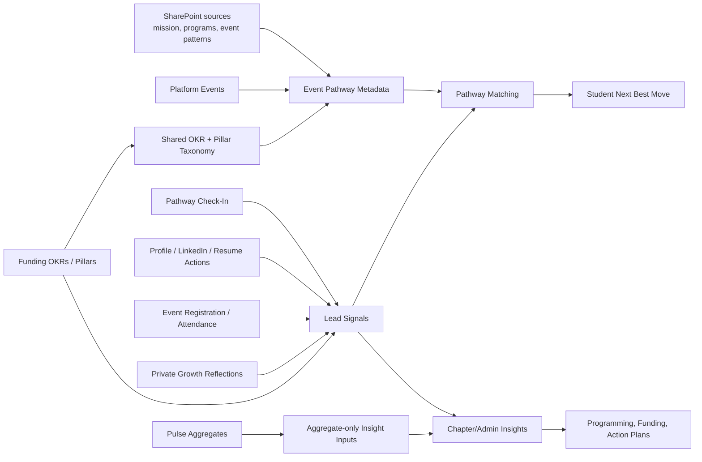

# Lead Intelligence Layer Integration Plan

Status: V1 event-metadata slice implemented on `codex/lead-intelligence-pathway-prd`; broader intelligence layer remains proposal
Last updated: 2026-05-25
Related docs:

- `docs/proposals/personalized-growth-and-opportunity-layer-prd.md`
- `docs/proposals/new-student-pathway-check-in-prd-v2.md`
- `docs/proposals/integrated-chapter-pathway-ux-project-specification.md`
- `docs/proposals/pathway-resource-catalog-working-notes.md`
- `docs/runbooks/lead-intelligence-event-pathway-v1-validation.md`
- `docs/PRODUCT-SPECIFICATION.md`
- `docs/adr/004-chapter-scoped-roles-permissions.md`

Skills used: office-hours product strategy, architecture design, domain modeling.

## Implementation Closure Snapshot

The V1 event-first slice has been implemented in this branch:

- `event_pathway_metadata` owns event recommendation meaning.
- Shared taxonomy constants are centralized in `lib/lead-taxonomy.ts`.
- `PathwayIntelligenceService` matches Check-In answers to eligible upcoming events and falls back to profile/proof actions.
- Chapter event create/edit can opt an event into Pathway with structured metadata.
- Student recommendations now carry source traceability, metadata-aware CTAs, matched reasons, and proof-loop links.
- Growth Reflection remains private and can complete the linked recommendation when submitted as completed proof.

What did not ship:

- Broad resource catalog.
- AI recommendation engine.
- SharePoint runtime ingestion.
- Pulse-to-student personalization.
- Recruiter readiness scoring.
- Professionals/Ambassadors/HER routing.
- Past event materials as self-study recommendations.

Validation is recorded in `docs/runbooks/lead-intelligence-event-pathway-v1-validation.md`. Authenticated browser QA is tracked separately in GitHub issue #253 because the local seeded login fixture blocked protected-route screenshots during #252.

## Position

The LEAD Intelligence Layer should not start as a big AI dashboard.

It should start as an evidence spine: a structured way for the platform to connect student intent, events, reflections, OKRs, chapter activity, Pulse, funding, and future impact metrics into explainable recommendations and aggregate insights.

The right order is:

1. Operational truth.
2. Event Pathway metadata.
3. Deterministic recommendations.
4. Normalized evidence signals.
5. Aggregate insights.
6. AI assistance only after the evidence layer is trustworthy.

This keeps the product honest. Intelligence should never claim more than the platform can actually observe.

## Current Platform Reality

The current platform already has the foundation for an intelligence layer:

| Area | Current status | Intelligence implication |
| --- | --- | --- |
| Account model | `user`, `person_profile`, `chapter_membership`, `lead_identity`, and `recruiter_access` are separate. | Intelligence can personalize without confusing identity, membership, recruiter visibility, or chapter permissions. |
| Events | The product already manages events, registrations, application questions, and event-chapter relationships. | Events should be the first real recommendation source because they create concrete student action. |
| Pathway | `pathway_check_in` captures student intent and creates `learn`, `connect`, and `prove` recommendations. | Pathway is the student-facing action layer, but recommendations are still generic. |
| Growth reflections | `growth_reflection` captures private learning/proof after events or recommendations. | Reflections are the first proof signal, but they must stay private unless the student explicitly shares or converts them. |
| Feature flags | `pathway_feature_flag` can enable check-in, recommendations, reflections, and chapter insights by chapter/global scope. | Intelligence can be piloted safely before national rollout. |
| Funding | Funding already uses `okr_keys` and `pillar_keys`. | The intelligence taxonomy should reuse the same OKR/pillar language instead of inventing a new vocabulary. |
| Permissions | Chapter-scoped permissions already anticipate Pulse, Impact Metrics, and funding workflows. | Admin/chapter insights can be gated without making every insight student-visible. |
| SharePoint | SharePoint contains mission, event, program, feedback, and operating materials. | SharePoint should inform taxonomy and catalog curation, not automatically feed student recommendations. |
| LinkedIn | LinkedIn is currently external to the platform. | V1 should treat LinkedIn as a profile/proof action and evidence signal, not as a direct integration dependency. |

## Event Metadata Audit

Current events are strong enough for operations, registration, and attendance.

They are not yet strong enough for Pathway-quality intelligence without an added catalog or metadata layer.

Current event creation captures:

- title
- description
- cover image
- start/end time
- physical/online/hybrid logistics
- capacity
- published/draft state
- owner chapter and collaborating chapters
- open versus application access
- native application questions
- location fields and coordinates

That is enough to answer:

- Can a student register or apply?
- Where and when is the event?
- Which chapter owns it?
- How many students can attend?
- Who registered, applied, got approved, or attended?

It is not enough to answer:

- Which LEAD OKR does this event support?
- Which impact pillar does it belong to?
- Which student pathway goal does it help?
- Which growth stage is it best for?
- What student outcome should it produce?
- What proof should the student create afterward?
- Is it safe to recommend automatically?
- Is this an open action, an application/postulation action, or a manually curated opportunity?
- What evidence signal should count after the event?

This matters because a title like "AI for Social Impact" or "Networking Intercapitulos Lima" is understandable to a human, but the platform should not infer strategy from text alone. For the intelligence layer, event meaning needs to be explicit.

## Minimum Event Intelligence Metadata

For V1, the platform needs one of these three paths:

1. Add intelligence metadata directly to events.
2. Create a broad `pathway_resource_catalog` layer that references events and supplies the metadata.
3. Create focused `event_pathway_metadata` for event-specific recommendation metadata.

Decision after review: choose path 3 for V1.

Events should stay operational. `event_pathway_metadata` should decide whether a published event is eligible for Pathway recommendations. A broad resource catalog can come later when non-event resources become first-class.

Minimum event Pathway metadata:

| Field | Purpose |
| --- | --- |
| `event_id` | Connect the metadata to the real platform event. |
| `is_pathway_eligible` | Whether this event can be considered by Pathway. |
| `primary_okr` | Main organizational objective: `inspire`, `unite`, `empower`, or `elevate`. |
| `okr_alignment` | Secondary OKRs supported by the event. |
| `pillar_keys` | LEAD pillar alignment. |
| `student_goal` | Which Pathway goal this event helps. |
| `growth_stage_fit` | Which student stage should see it first. |
| `student_outcomes` | What the student should gain. |
| `proof_outcome` | Reflection, resume bullet, LinkedIn update, pitch deck, certificate, portfolio item, or none. |
| `evidence_signals` | What the platform can measure after the event. |
| `audience` | Newly approved member, chapter member, e-board, public attendee, etc. |
| `recommendation_cta_type` | Register, apply/postulate, update profile, complete reflection, submit proof. |
| `recommendation_safety` | Recommendable now, only if active, future only, or never auto-recommend. |
| `coordination_risk` | Self-serve, chapter-managed, partner-managed, requires manual selection. |
| `metadata_status` | Draft, complete, archived. |

Minimum event admin form change:

- Add an "Intelligence / Pathway fit" section when publishing or approving an event for recommendation.
- Keep it optional for plain event creation, but required before the event can enter Pathway recommendations.
- Use controlled choices, not free-text, so reporting stays clean.

Do not make every event creator answer a long strategic questionnaire. The first version should ask only:

1. What is the main OKR?
2. What LEAD pillar does this support?
3. Who is this best for?
4. What should the student get out of it?
5. What should the student do after?
6. Is this open registration or application/postulation?

## Event Readiness Decision

An event should be eligible for Pathway only if it has:

- a published active/upcoming event record
- a clear owner chapter or global owner
- a clear audience
- a clear CTA: register or apply/postulate
- at least one OKR
- at least one pillar
- at least one student outcome
- at least one evidence signal
- a recommendation safety value

If any of those are missing, the event can still exist in the event system, but it should not be used by the intelligence layer yet.

Normal chapter events do not need admin approval to become Pathway eligible. The guardrail is structured metadata validation, not a review queue. Admin approval should be reserved for national featuring, partner-sensitive events, special programs, or manual exceptions.

## Problem

The platform is close to having enough activity data, but it does not yet turn that data into decisions.

Students need to know:

- What is my next best LEAD move?
- Why is this recommended for me?
- What proof or growth will this help me create?

Chapters need to know:

- What do our members need more of?
- Are we offering the right events for those needs?
- Which OKRs and pillars are underserved?

National/admin users need to know:

- Which parts of LEAD are producing evidence of growth?
- Which chapters or event types need support?
- What should be funded, repeated, improved, or retired?

Partners and recruiters eventually need:

- Consent-aware signals of student readiness.
- Proof that LEAD experiences produce real student outcomes.
- No exposure of private Pulse responses or private reflections.

## Canonical Product Boundaries

Use these boundaries to prevent feature confusion:

| Layer | Core question | Identity/privacy stance |
| --- | --- | --- |
| Pathway | What should I do next for my growth? | Logged-in, personalized, student-facing. |
| Event Pathway metadata | Which published events are safe and useful to recommend? | Structured by chapter/event owners; validated by the platform. |
| Pulse | How is the LEAD/chapter experience going? | Anonymous or aggregate-first. Not used to identify individual students. |
| Growth reflection | What did I learn, and what proof can I create? | Private by default. Student controls conversion into visible proof. |
| Impact Metrics | What happened and what changed? | Aggregate evidence for LEAD/chapter/admin reporting. |
| Funding | Which initiatives deserve resources and why? | OKR/pillar-aligned operational workflow. |
| Intelligence Layer | What patterns and next actions can we infer from evidence? | Explainable, permissioned, and privacy-aware. |

## Premises

1. Pathway should serve students first. It should help a student take one concrete next action, not diagnose the entire organization.
2. Pulse should remain a listening tool. It should not become a hidden personalization input that breaks anonymity.
3. Events are the strongest V1 recommendation source because they are concrete, time-bound, and measurable.
4. SharePoint is a taxonomy and evidence source, not a runtime recommendation engine.
5. OKRs should be shared across funding, Pathway, and intelligence: `inspire`, `unite`, `empower`, and `elevate`.
6. Intelligence should be deterministic and explainable before it becomes AI-assisted.
7. Student readiness and recruiter visibility must be consent-aware. Growth stage is not permission, rank, or public readiness.

## System Concept

## Approaches Considered

### Approach A: Event Pathway Metadata + OKR Evidence

Summary: Extend the existing Pathway flow with event-specific Pathway metadata and OKR/pillar tags. Recommendations remain deterministic and event-driven.

Effort: M
Risk: Low

Pros:

- Reuses current Pathway, events, reflections, funding OKRs, and feature flags.
- Gives students immediate value without waiting for a full data platform.
- Keeps recommendations explainable: "we recommended this because it matches your goal, stage, chapter, and OKR need."

Cons:

- Limited cross-module intelligence at first.
- Requires chapter/event creators to fill structured metadata when they want Pathway eligibility.
- Admin insights will be useful but not yet deep.

Reuses:

- `pathway_check_in`
- `pathway_recommendation`
- `growth_reflection`
- `event`
- `event_registration`
- funding `okr_keys` and `pillar_keys`
- `pathway_feature_flag`

### Approach B: Lead Signal Spine

Summary: Add a normalized internal evidence layer where platform events, registrations, reflections, profile actions, funding activity, and future Pulse aggregates become structured `lead_signal` records or views.

Effort: L
Risk: Medium

Pros:

- Best long-term foundation for intelligence, OKR reporting, Impact Metrics, and AI summaries.
- Makes evidence reusable across Pathway, chapters, funding, and admin reporting.
- Keeps raw workflow tables clean while giving intelligence one shared language.

Cons:

- Requires stronger data governance and service ownership.
- Easy to overbuild before the first Pathway pilot proves value.
- Needs careful privacy modeling for user-level vs aggregate-only signals.

Reuses:

- Current service layer pattern.
- Chapter-scoped permissions.
- Existing event, Pathway, reflection, and funding tables.

### Approach C: AI Advisory Layer

Summary: Build an AI assistant for admins or chapter operators that summarizes evidence, suggests programming gaps, and drafts action plans with citations.

Effort: XL
Risk: High

Pros:

- Could make SharePoint and platform evidence much easier to use.
- Strong executive/admin experience if grounded in structured evidence.
- Could eventually help generate chapter action plans from Pulse plus event data.

Cons:

- Too risky before the platform has reliable signals.
- Privacy risk if Pulse/reflection boundaries are not enforced first.
- Hallucination risk if AI can cite raw or messy documents without curation.

Reuses:

- Future signal spine.
- Curated SharePoint source references.
- Admin/chapter insight views.

## Recommendation

Do Approach A now, design Approach B in parallel, and defer Approach C.

The current platform is ready for event-metadata-backed Pathway intelligence, not full AI intelligence. The student value should prove itself first: "I logged in, answered a short check-in, and LEAD gave me one good next move that made sense."

Once that works, the same evidence can become chapter insights, funding justification, and Pulse-informed action planning.

## Skill-Guided Approach Review

Review lenses used:

- Architecture design: service boundaries, data ownership, and sequencing.
- Domain modeling: whether terms are clean enough to avoid feature confusion.
- Safety/careful mode: avoid destructive assumptions, privacy leakage, and overclaiming.

Verdict: keep the direction, but narrow the first implementation.

The proposed direction is right if the first build is an event-metadata-backed Pathway improvement, not a broad intelligence platform. It becomes risky if a catalog turns into a second event system, if Pulse enters individual personalization too early, or if recommendations are generated without auditable links to their source.

### What Holds Up

| Proposal piece | Review result | Why |
| --- | --- | --- |
| Structured metadata before AI | Keep | The current data is not mature enough for AI recommendations. Deterministic matching is safer and more explainable. |
| Events as V1 recommendation source | Keep | Events are concrete, time-bound, measurable, and already connected to registrations and attendance. |
| OKR/pillar alignment | Keep | Funding already uses `inspire`, `unite`, `empower`, `elevate`, plus pillar keys. Reuse avoids a second strategy vocabulary. |
| Pulse as aggregate-only input | Keep | Anonymity and trust matter more than personalization here. |
| Feature-flagged rollout | Keep | Pathway is already chapter/global flag controlled, so intelligence should inherit that rollout posture. |
| AI later | Keep | AI should summarize evidence after structured signals exist, not become the source of truth. |

### What Needs Correction

| Risk | Correction |
| --- | --- |
| Catalog becomes a duplicate event table. | Do not build a broad catalog in V1. Treat `event` as the operational source of truth and use `event_pathway_metadata` as a focused recommendation annotation layer. Dates, capacity, registration state, access model, and publication state must come from `event`. |
| `pathway_recommendation` loses traceability. | Add or plan fields such as `source_type`, `source_event_id`, `cta_type`, and `evidence_signal`, or introduce `pathway_recommendation_source` before claiming recommendations are auditable. |
| Existing Pathway category model is too rigid. | The current unique `(check_in_id, category)` model supports only one `learn`, one `connect`, and one `prove` recommendation. V1 can still work with one primary move plus support actions, but future ranking needs a match table. |
| Metadata burden could block event creation. | Keep normal event creation lightweight. Require Pathway metadata only when the chapter chooses to make an event Pathway eligible. |
| OKR constants currently live in funding service. | Extract shared OKR/pillar taxonomy to a neutral module before Pathway depends on it. Pathway should not import funding just to know LEAD strategy keys. |
| Lead signals could be overbuilt. | Start with service-level aggregation or database views. Do not create a physical `lead_signal` table until two modules need the same signal abstraction. |
| Application events may overpromise. | Represent them as apply/postulate CTAs only. Do not phrase them as guaranteed access or seats. |
| Human curation could become a bottleneck. | Avoid a V1 approval queue for normal chapter events. Let chapters self-serve Pathway eligibility through required structured fields. |

### Canonical Terms

Use these terms consistently:

| Term | Meaning |
| --- | --- |
| Event | Operational occurrence with time, place/link, capacity, access model, owner chapter, registration/application, and attendance. |
| Event Pathway metadata | A focused 1:1 annotation for a platform event. It owns Pathway eligibility, OKR/pillar fit, audience, outcome, CTA, proof prompt, and recommendation safety. |
| Resource catalog item | Future broader wrapper for non-event resources or platform actions. It should not be built in V1 unless non-event resources become first-class. |
| Pathway recommendation | A personalized next move shown to one student. In V1, it should reference an event or fixed platform action when possible. |
| Lead signal | A normalized evidence fact derived from platform activity, such as registration, attendance, reflection completed, profile updated, or aggregate Pulse theme. |
| Pulse aggregate | Anonymous/thresholded survey result for chapter/admin insight. It is not a student-level personalization input. |
| Proof action | A student-controlled action that turns participation into evidence, such as reflection, resume bullet, LinkedIn update, project note, or portfolio item. |

### Revised First Build

The first build should be smaller than the full plan:

1. Define shared taxonomy constants for OKRs, pillars, outcomes, CTA types, and safety states.
2. Add `event_pathway_metadata` as the event-specific recommendation metadata layer.
3. Add only the minimum metadata needed for recommendation safety and explanation.
4. Extend Pathway recommendations so each recommendation can preserve source type, source event id, CTA type, evidence signal, and match reason.
5. Replace the generic `connect` recommendation with an event/community-safe alternative, since V1 should not send students to individual leaders, VPs, or area directors.
6. Test the matching service with a tiny set of Pathway-eligible events.

Do not build these first:

- full `lead_signal` event table
- AI assistant
- SharePoint ingestion
- recruiter-facing readiness score
- Pulse-to-student personalization
- broad event metadata overhaul

### Architecture Decision

This is probably worth an ADR once implementation starts:

Decision: keep `event` operational and introduce `event_pathway_metadata` instead of adding all intelligence metadata directly to `event` or building a broad catalog table in V1.

Why it deserves an ADR:

- Hard to reverse after data is created.
- Future contributors may reasonably ask why event metadata is split.
- It is a real trade-off between simpler event editing and stronger recommendation governance.

## Recommended Roadmap

### Phase 0: Stabilize Operational Truth

Goal: Make sure the platform knows what is real before it recommends anything.

Work:

- Confirm which seeded/platform events are real launch candidates versus QA/demo data.
- Ensure each recommendable event has date, owner, audience, availability, registration/application CTA, and chapter/global scope.
- Remove or rewrite generic "talk to your chapter leader / VP / area director" actions from the Pathway recommendation set.
- Keep feature flags as the rollout control.
- Define which students are in the V1 pilot: newly approved chapter members.

Done when:

- Pathway can point to real active/upcoming resources without creating false promises.

### Phase 1: Event-Metadata-Backed Pathway

Goal: Replace generic recommendations with real LEAD actions.

Work:

- Create `event_pathway_metadata` as a 1:1 Pathway annotation for events.
- Let chapter event creators make events Pathway eligible by completing required structured metadata.
- Keep profile, LinkedIn, resume, and growth reflection actions as fixed platform fallback/support actions for V1.
- Use OKR and pillar keys already present in funding.
- Use SharePoint as taxonomy evidence and historical templates, not automatic student-facing content.
- Recommend application-based events only as "apply" or "postulate" actions, never as guaranteed access.
- Store or expose the "why this fits" reason for every recommendation.

Done when:

- A student receives one primary next move plus support actions.
- The recommendation can explain the OKR, outcome, and evidence signal.

### Phase 2: Lead Signal Definitions

Goal: Define the evidence language before building dashboards.

Candidate signals:

- `check_in_completed`
- `event_registration_created`
- `event_attendance_confirmed`
- `application_submitted`
- `growth_reflection_completed`
- `profile_updated`
- `linkedin_updated`
- `resume_updated`
- `proof_submitted`
- `funding_request_submitted`
- `funding_request_approved`
- `pulse_theme_detected` as aggregate-only, never individual respondent-level

Each signal should include:

- source system
- source record id
- optional user id
- chapter id
- OKR alignment
- pillar alignment
- privacy scope
- evidence confidence
- occurred_at

Done when:

- Admin metrics and Pathway logic can share the same evidence vocabulary.

### Phase 3: Chapter/Admin Insights

Goal: Give operators useful aggregate intelligence without ranking students or chapters.

Useful first insights:

- Member demand by primary focus.
- Event supply by OKR and pillar.
- Recommendation-to-registration conversion.
- Reflection/proof conversion after events.
- Gaps such as "many members want career readiness, few upcoming `elevate` resources."
- Chapter needs that can inform programming, not public comparison.

Done when:

- A chapter operator can choose the next event or support action based on member needs.

### Phase 4: Pulse Integration

Goal: Connect Pulse without breaking anonymity.

Rules:

- Pulse can influence chapter/admin insights only in aggregate.
- Pulse should not personalize individual student recommendations unless the student explicitly opts into a non-anonymous follow-up workflow.
- Use minimum group thresholds before showing aggregates.
- Pulse themes should point to action plans and resource gaps, not individual interventions.

Example:

- If Pulse shows low belonging for a chapter, the intelligence layer can suggest more `unite` resources or chapter community events.
- It should not identify which students gave low belonging responses.

Done when:

- Pulse informs chapter action plans while preserving trust.

### Phase 5: Funding and Impact Metrics Loop

Goal: Make funding decisions and impact reporting evidence-based.

Work:

- Connect funding requests to OKR/pillar demand from Pathway and chapter insights.
- After funded events, capture event registration, attendance, reflection, and proof signals.
- Report outcomes by OKR without overclaiming causality.

Done when:

- Funding can answer: "What need did this support, who participated, what evidence came back, and what should we do next?"

### Phase 6: AI Assistance

Goal: Add AI only where it can cite evidence and respect privacy.

First AI surface should be admin/chapter-facing, not student-facing:

- Summarize chapter needs.
- Draft event/programming suggestions.
- Draft Pulse action-plan language from aggregate results.
- Summarize OKR evidence with citations to platform records and approved source references.

Rules:

- No AI recommendation without citations.
- No raw Pulse respondent data.
- No private reflection exposure.
- No student ranking.
- No recruiter-facing claims from private/internal signals.

Done when:

- AI helps operators understand evidence faster, but deterministic services still own decisions.

## Proposed Domain Model

These are planning concepts, not immediate migrations.

### `event_pathway_metadata`

Owns event-specific recommendation metadata.

Fields:

- `event_id`
- `is_pathway_eligible`
- `primary_okr`
- `okr_alignment`
- `pillar_keys`
- `student_goal`
- `growth_stage_fit`
- `student_outcomes`
- `proof_outcome`
- `evidence_signals`
- `audience`
- `cta_type`
- `coordination_risk`
- `recommendation_safety`
- `metadata_status`
- `created_by_id`
- `updated_by_id`

Operational fields such as title, date, capacity, access model, registration/application status, publication state, location, and owner chapter must continue to come from `event`.

### `pathway_recommendation_source`

Owns traceability for recommendations.

Fields:

- `recommendation_id`
- `source_type`: event, profile_action, resume_action, linkedin_action, growth_reflection_action
- `source_event_id`
- `cta_type`
- `evidence_signal`
- `score`
- `matched_reasons`
- `blocked_reasons`
- `created_at`

This can start as extra columns on `pathway_recommendation` if the implementation stays simple. If the model needs multiple source candidates per recommendation, use a separate source/match table.

### `lead_signal`

Owns normalized evidence.

Fields:

- `signal_type`
- `source_system`
- `source_record_id`
- `user_id` nullable
- `chapter_id`
- `okr_keys`
- `pillar_keys`
- `privacy_scope`
- `evidence_confidence`
- `occurred_at`

For V1, this can be implemented as database views or service-level aggregation before becoming a physical event table.

### `chapter_intelligence_snapshot`

Owns aggregate insight snapshots.

Fields:

- `chapter_id`
- `period_start`
- `period_end`
- `member_need_summary`
- `okr_distribution`
- `pillar_distribution`
- `resource_gap_summary`
- `risk_flags`
- `generated_at`

### `pulse_aggregate`

Owns anonymous Pulse results.

Fields:

- `chapter_id`
- `period`
- `question_key`
- `aggregate_value`
- `response_count`
- `minimum_threshold_met`
- `theme_keys`

No individual respondent identity should be exposed through this layer.

### `source_reference`

Owns approved references to SharePoint or other source material.

Fields:

- `source_system`
- `source_url`
- `source_title`
- `source_type`
- `approved_for_catalog`
- `approved_for_ai_context`
- `notes`

## Service Boundaries

| Service | Responsibility | Should own |
| --- | --- | --- |
| `EventPathwayMetadataService` | Create, update, and validate event Pathway metadata. | Eligibility fields, safety, OKR/pillar/outcome validation. |
| `PathwayIntelligenceService` | Match students to next best moves. | Deterministic scoring, explanation, fallback behavior. |
| `LeadSignalService` | Normalize evidence from platform activity. | Signal definitions, privacy scope, confidence. |
| `ChapterIntelligenceService` | Produce aggregate chapter/admin insights. | Demand/supply gaps, OKR views, pilot metrics. |
| `PulseInsightService` | Convert Pulse into aggregate-only insight inputs. | Thresholds, anonymization, action-plan themes. |
| `LeadTaxonomyService` | Expose shared OKR, pillar, outcome, CTA, and safety constants. | Shared taxonomy so Pathway does not import funding service constants. |

## How The Module Link Should Work

Pathway should appear as a normal logged-in student module, likely from the student dashboard.

Student flow:

1. Student logs in.
2. Dashboard shows a Pathway card or notification: "Your next best LEAD move is ready."
3. Student completes or updates the Pathway check-in.
4. The system matches them to an event-backed recommendation or a fixed support action.
5. The recommendation CTA points to one of:
   - event registration
   - event application/postulation
   - profile update
   - LinkedIn/resume action
   - growth reflection/proof action
6. After the action, the platform records an evidence signal.
7. The next recommendation improves based on what happened.

Pulse can also be linked from the dashboard, but it should feel different:

- Pathway: personalized, logged-in, action-oriented.
- Pulse: anonymous or aggregate-first, experience-oriented.

If Pulse requires login to prevent duplicate responses, the platform still needs an anonymization boundary between identity/access control and reportable survey answers.

## LinkedIn Integration Stance

Do not make LinkedIn a hard external integration in V1.

Use it as:

- a profile completeness action
- a post-event proof action
- a self-attested evidence signal
- a future optional integration point

Good V1 examples:

- "Turn this experience into a LinkedIn update."
- "Add one project, certificate, or event outcome to your profile."
- "Mark LinkedIn update completed."

Avoid in V1:

- auto-posting
- scraping LinkedIn
- ranking students by LinkedIn polish
- recruiter-facing claims based only on self-attested LinkedIn activity

## Privacy And Safety Rules

- Do not identify anonymous Pulse respondents.
- Do not expose private reflections to chapters, recruiters, or partners.
- Do not rank students publicly.
- Do not rank chapters in a way that creates shame or toxic comparison.
- Do not recommend individual leaders, VPs, mentors, or area directors as V1 next actions.
- Do not recommend special programs unless availability, eligibility, owner approval, and workflow are explicit.
- Do not ingest raw SharePoint folders into student recommendations.
- Do not make AI the source of truth.
- Do not present application-based events as guaranteed access.
- Do not make growth stage a permission model or recruiter-readiness label.

## Success Criteria

Student-level:

- Pathway check-in completion rate.
- Recommendation click or start rate.
- Registration/application/profile/reflection completion after recommendation.
- Next move completion within 14 days.
- Student says the recommendation felt clear and useful.

Chapter-level:

- Chapter can see member needs by focus/OKR/pillar.
- Chapter can identify at least one programming gap.
- Chapter can connect an event to member demand and OKR evidence.

Admin-level:

- Admin can see which OKRs have evidence and which are under-supported.
- Funding can reference actual demand and post-event evidence.
- Pulse can inform action plans without privacy leakage.

Trust-level:

- Students understand what is personalized and what is anonymous.
- Private reflections remain private.
- AI outputs, when added later, cite approved records and sources.

## Immediate Next Decisions

1. Confirm the V1 pilot segment: newly approved chapter members.
2. Decide which platform events are real launch candidates versus demo/QA seed data.
3. Decide the exact required fields for `event_pathway_metadata`.
4. Decide minimum Pulse aggregate threshold before chapter/admin reporting.
5. Decide whether LinkedIn completion is self-attested in V1 or stored as a profile field.
6. Decide whether traceability lives as columns on `pathway_recommendation` or in a separate `pathway_recommendation_source` table.

## My Recommendation For The Next Build Step

Build the event-metadata-backed Pathway layer first.

Concretely:

1. Replace generic Pathway recommendations with event-backed recommendations when eligible events exist.
2. Add `event_pathway_metadata` instead of a broad catalog table.
3. Store OKR, pillar, outcome, CTA, safety, and evidence metadata per event.
4. Keep LinkedIn/resume/reflection as support actions.
5. Keep Pulse out of individual personalization until the anonymity model is designed.
6. Add signal definitions before building broad dashboards.

This is the narrowest useful wedge. It gives students a better experience now and creates the evidence foundation for the bigger LEAD Intelligence Layer later.
